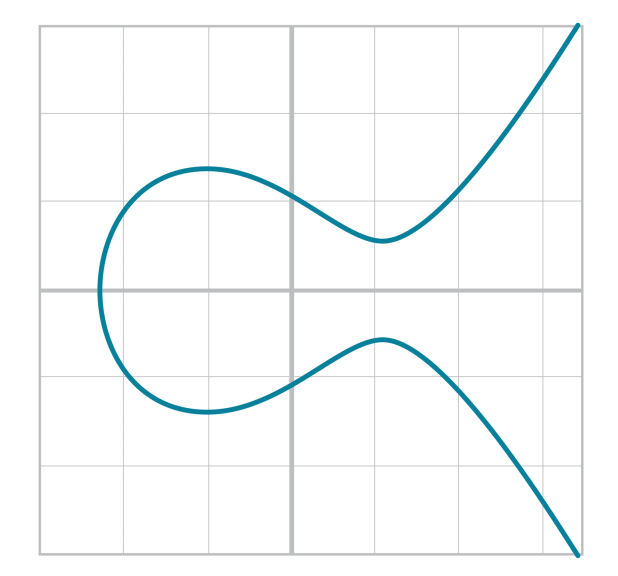
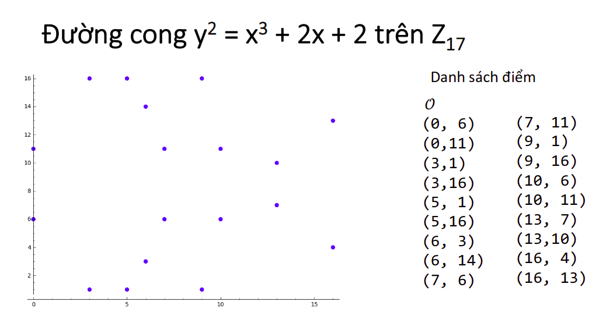
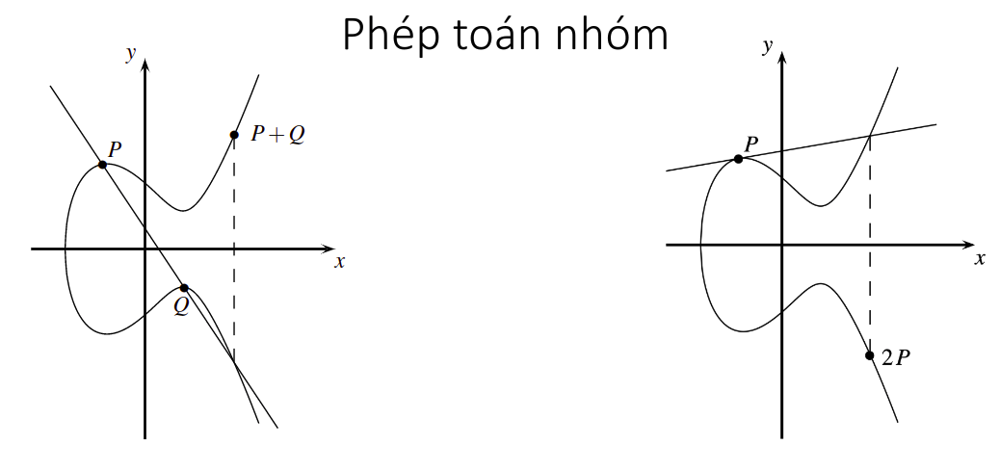
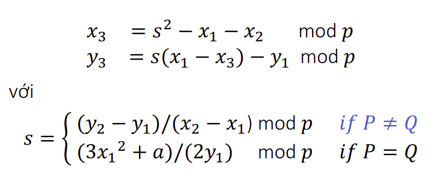

# Đường cong Elliptic Curves

## I. Định nghĩa 
- Đường cong Elliptic Curves trên K là tập mọi cặp (x, y) thỏa mãn phương trình : ```y^2 = x^3 + ax + b``` cùng với một điểm vô cực 0. Trong đó a, b thuộc K và thỏa mãn **4 * a^3 + 27 * b^2 != 0** 

- Đồ thị của đường cong có dạng:





- Đặc biệt đường cong Elliptic Curves được sử dụng trong bitcoin có phương trình:

    ```y^2 = x^3 + 7```
- Đây là một dạng của đường cong Elliptic Curves với a = 0 và b = 7.

## II. Các phép toán nhóm trên đường cong Elliptic Curves

- Kí hiệu phép toán nhóm bởi kí hiệu cộng (+)
- Cho hai điểm P = (x1, y1) và Q = (x2, y2)
- Ta phải tính tọa độ của điểm thứ ba R thỏa mãn:

    ```
        P    +    Q     =    R
    (x1, y1) + (x2, y2) = (x3, y3)
    ```
- Phép cộng điểm P+Q: Trường hợp R=P+Q và P!=Q
- Phép nhân đôi điểm P+P: Trường hợp P+Q nhưng P==Q



- Công thức tính toán



## III. Xây dựng Elliptic Curves với Golang

- Tạo struct EllipticCurves
```
type EllipticCurves struct {
	x int32
	y int32
	a int32
	b int32
}
```

- Hàm khởi tạo EllipticCurves
```
func Init(x, y, a, b int32) (error, EllipticCurves) {
	if y*y != (x*x*x + a*x + b) {
		err := "Error (x, y) is not on the curve"
		e := errors.New(err)
		return e, EllipticCurves{}
	}
	return nil, EllipticCurves{
		x: x,
		y: y,
		a: a,
		b: b,
	}
}
```

- Hàm tính tổng 2 điểm 
```
func Add(e1, e2 EllipticCurves) (error, EllipticCurves) {
	if e1.a != e2.a || e1.b != e2.b {
		err := "Two point are not on the same curves"
		e := errors.New(err)
		return e, EllipticCurves{}
	}

	if e1.x == INF {
		return nil, e2
	}

	if e2.x == INF {
		return nil, e1
	}

	//handle the case where the two points are additive inverses
	if e1.x == e2.x && e1.y != e2.y {
		return nil, EllipticCurves{
			x: INF,
			y: INF,
			a: e1.a,
			b: e1.b,
		}
	}

	// P != Q
	if e1.x != e2.x && e1.y != e2.y {
		s := (e2.y - e1.y) / (e2.x - e1.x)
		x := s*s - e1.x - e2.x
		y := s*(e1.x-x) - e1.y
		return nil, EllipticCurves{
			x: x,
			y: y,
			a: e1.a,
			b: e2.b,
		}
	}

	// P == Q
	if e1.x == e2.x && e1.y == e2.y {
		if e1.y == 0 {
			return nil, EllipticCurves{
				x: INF,
				y: INF,
				a: e1.a,
				b: e1.b,
			}
		} else {
			s := (3*e1.x*e1.x + e1.a) / 2 * e1.y
			x := s*s - 2*e1.x
			y := s*(e1.x-x) - e1.y
			return nil, EllipticCurves{
				x: x,
				y: y,
				a: e1.a,
				b: e1.b,
			}
		}
	}

	return nil, EllipticCurves{}
}
```
